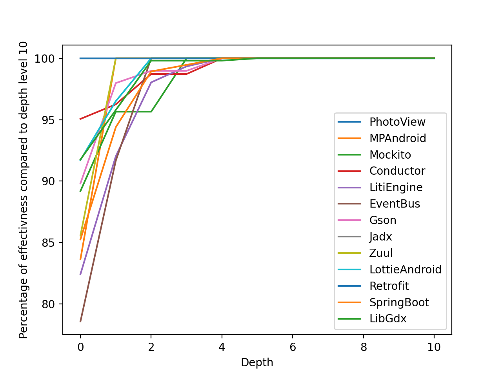

# NullAwayAutoFixer
```NullAwayAutoFixer``` (or simply ```AutoFixer```) is a tool that can automatically infer types in source code and injects the 
corresponding annotations to pass [NullAway](https://github.com/uber/NullAway).

```AutoFixer``` is fast, it benefits from a huge parallelization technique to deliver the final product. On average, 
it is capable of reducing the number of warnings reported by ```NullAway``` down to 30%. Annotations are directly injected to the source code 
and it preserves the code style.

# Code Example

In the code below, ```NullAway``` will generate three warnings

```java
public class Test{
    Object bar = new Object();
    Object nullableFoo; //warning: "nullableFoo" is not initialized
    Object nonnullFoo; //warning: "nonnullFoo" is not initialized
    
    public Object run(boolean check){
        if(check){
            return new Object();
        }
        return null; //warning: returning nullable from nonNull method
    }
    
    public void display(){
        if(nullableFoo != null){
            String name = nullableFoo.toString();
            Class<?> clazz = nullableFoo.getClass();
        }
        String name = nonnullFoo.toString();
        Class<?> clazz = nonnullFoo.getClass();
    }
}
```

```AutoFixer``` can automatically infer ```nullableFoo``` to be ```@Nullable``` and ```nonnullFoo``` to be ```@Nonnull```.
Therefore, it makes ```nullableFoo```, ```@Nullable``` and leave ```nonnullFoo``` untouched.

Below is the output of running AutoFixer on the code above:

```java
import javax.annotation.Nullable;

public class Test {
    Object bar = new Object();
    @Nullable Object nullableFoo; // resolved by AutoFixer
    Object nonnullFoo; //warning: "nonnullFoo" is not initialized (AutoFixer will not make it Nullable since it produces a lot more errors).

    public @Nullable Object run(boolean check) {
        if (check) {
            return new Object();
        }
        return null; // resolved by AutoFixer
    }

    public void display() {
        if (nullableFoo != null) {
            String name = nullableFoo.toString();
            Class<?> clazz = nullableFoo.getClass();
        }
        String name = nonnullFoo.toString();
        Class<?> clazz = nonnullFoo.getClass();
    }
}
```

```AutoFixer``` propagates effects of a change through the entire module and inject several annotations to fully resolve one specific warning.
In the example below, making ```foo```, ```@Nullable``` requires two more ```@Nullable``` injections and ```AutoFixer``` automatically takes care of it.

```java
public class Test{
    Object foo; //warning: "nullableFoo" is not initialized

    public Object run(){
        bar(foo); // if foo was @Nullable, we would have seen the warning: passing nullable to nonnull param
        return foo; // if foo was @Nullable, we would have seen the warning: returning nullable from non-null method
    }
    
    public void bar(Object foo){
        if(foo != null){
            String name = foo.toString(); 
        }
    }
}
```

However, ```AutoFixer``` automatically follows the chain of warnings and finds the best solution using it's ```deep search``` technique. 
Below is the output of running ```AutoFixer``` in one run:

```java
import javax.annotation.Nullable;

public class Test {
    @Nullable
    Object foo; //warning: resolved

    @Nullable
    public Object run() {
        bar(foo); //warning: resolved
        return foo; //warning: resolved
    }

    public void bar(@Nullable Object foo) {
        if (foo != null) {
            String name = foo.toString();
        }
    }
}
```

## Installation

```AutoFixer``` requires below projects to be installed in the ```local maven``` repository.

1. It injects selected annotations using [Injector](https://github.com/nimakarimipour/Injector). 
2. It needs a modified clone of [NullAway](https://github.com/nimakarimipour/NullAway) to be used in the target project. (Changes in the modified clone version will soon merge into the original repo)


Run ```dependecies.sh``` to install the above dependencies in maven local repository.

Or, please use the repo [Diagnoser](https://github.com/nimakarimipour/Diagnoser) which has python scripts which automates setup and running `AutoFixer` on target module. ```Diagnoser``` uses a jar file where all required dependencies are included and does not need any installation.

## Command Line Arguments

`AutoFixer` needs 5 arguments: 
```txt
1. command to execute NullAway: (example: ./grawdlew build)
2. output directory: (default: /tmp/NullAwayFix/)
3. AutoFixer Depth level: (default: 0, depth of search in search space)
4. Nullable Annotation: (fully qualified name of the annotation)
5. optimized: (flag to run optimized version)
```
To run `AutoFixer` please use the repo [Diagnoser](https://github.com/nimakarimipour/Diagnoser) which has python scripts which automates setup and running `AutoFixer` on target module. ```Diagnoser``` uses a jar file where all required dependencies are included and does not need any installation.

Regarding `AutoFixer Depth level`, the number of remaining warnings will reduce as the depth increases. However, in our experiments, 
level 4 is the sweet spot for having the best performance. Please look at the chart below, running the autofixer from level 0 to 10 over 20 open source projects. As you can see, on level 4 we reach the optimal solution.




## Artifact Evaluation

Due to complexity of making test cases (inputs are project modules :D ). I provided a [docker](https://github.com/nimakarimipour/DiagnoserDocker) script and the [repo](https://github.com/nimakarimipour/Docker_AE_NA) for artifact evaluation of this project where docker works with
